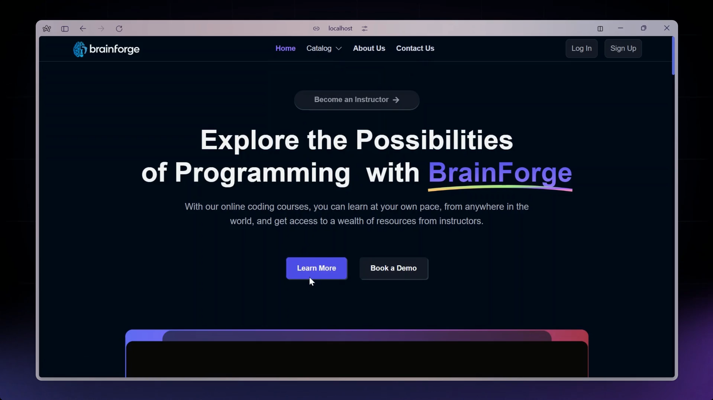
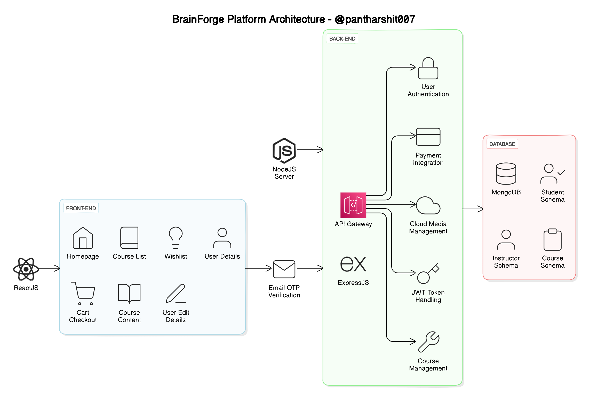
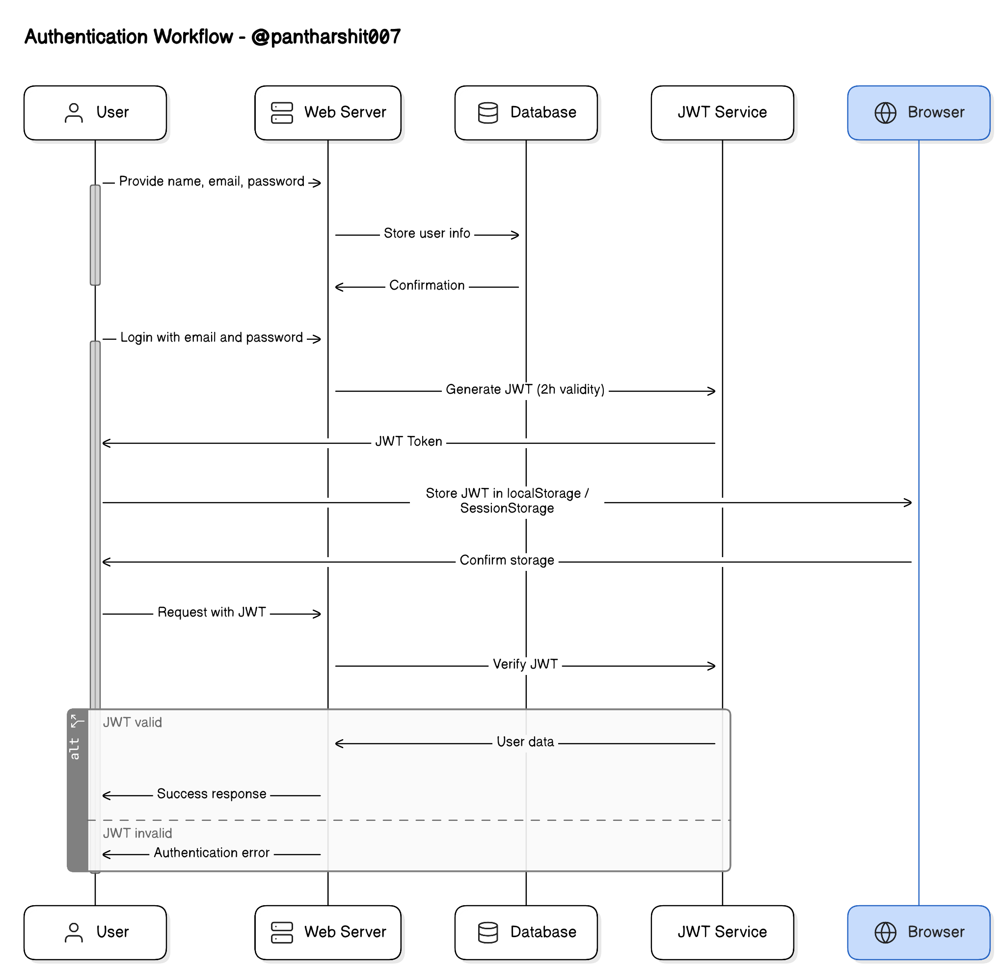
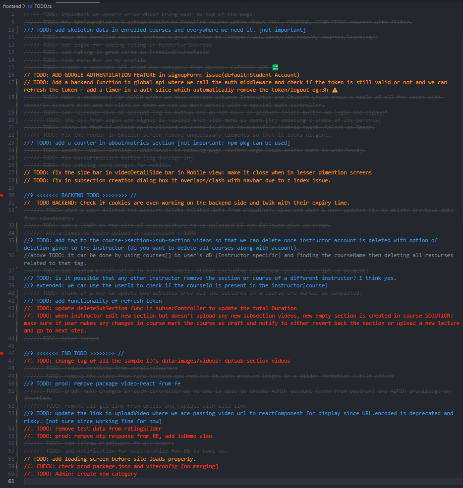

<h1 align="center"> BrainForge Project </h1>

## Demo Video

### MERN Based

- Cloud Architecture
  

- Sequence Diagram
  

## Table of Contents

- [Introduction](#introduction)
- [System Architecture](#system-architecture)
  - [Front-end](#front-end)
  - [Back-end](#back-end)
  - [Database](#database)
  - [Architecture Diagram](#architecture-diagram)
- [API Design](#api-design)
- [Installation](#installation)
- [Configuration](#configuration)
- [Usage](#usage)
- [Contributing](#contributing)
- [Todo](#todo)

## Introduction

BrainForge is a platform built to cater the need of both students who wants to learn and teacher who wants to provide something to the world.

In the following sections, we will cover the technical details of the platform, including the system architecture, API design, installation, usage instructions, and potential future enhancements.

## System Architecture

The BrainForge platform consists of three main components: the front-end, the back-end, and the database. The platform follows a client-server architecture, with the front-end serving as the client and the back-end and database serving as the server.

### Front-end

The front-end of the platform is built using ReactJS, which allows for the creation of dynamic and responsive user interfaces, crucial for providing an engaging learning experience to students. The front-end communicates with the back-end using RESTful API calls.

#### Front End Pages

For Students:

- **Homepage:** A brief introduction to the platform with links to the course list and user details.
- **Course List:** A list of all the courses available on the platform, along with their descriptions and ratings.
- **Cart Checkout:** Allows the user to complete course purchases.
- **Course Content:** Presents the course content for a particular course, including videos and related material.
- **User Details:** Provides details about the student's account, including their name, email, and other relevant information.
- **User Edit Details:** Allows students to edit their account details.

For Instructors:

- **Dashboard:** Offers an overview of the instructor's courses, along with ratings and feedback for each course.
- **Insights:** Provides detailed insights into the instructor's courses, including the number of views, clicks, and other relevant metrics.
- **Course Management Pages:** Enables instructors to create, update, and delete courses, as well as manage course content and pricing.
- **View and Edit Profile Details:** Allows instructors to view and edit their account details.

#### Front-end Tools and Libraries

To build the front-end, we use frameworks and libraries such as ReactJS, CSS, and Tailwind for styling, and Redux for state management with Framer-motion to power the animation.

##### For more Details go to Frontend Readme [here 🚀](/frontend)

### Back-end

The back-end of the platform is built using NodeJS and ExpressJS, providing APIs for the front-end to consume. These APIs include functionalities such as user authentication, course creation, and course consumption. The back-end also handles the logic for processing and storing the course content and user data.

#### Back-end Features

- **User Authentication and Authorization:** Students and instructors can sign up and log in to the platform using their email addresses and passwords. The platform also supports OTP (One-Time Password) verification and forgot password functionality for added security.
- **Course Management:** Instructors can create, read, update, and delete courses, as well as manage course content and media. Students can view and rate courses.
- **Payment Integration:** Students will purchase and enroll in courses by completing the checkout flow, followed by Razorpay integration for payment handling.
- **Cloud-based Media Management:** BrainForge uses Cloudinary, a cloud-based media management service, to store and manage all media content, including images, videos, and documents.
- **Markdown Formatting:** Course content in document format is stored in Markdown format, allowing for easier display and rendering on the front-end.

##### For more Details go to Backend Readme [here 🚀](/backend)

### Database

The database for the platform is built using MongoDB, a NoSQL database that provides a flexible and scalable data storage solution. MongoDB allows for the storage of unstructured and semi-structured data. The database stores the course content, user data, and other relevant information related to the platform.

### Architecture Diagram

Below is a high-level diagram that illustrates the architecture of the BrainForge platform:

## API Design

The BrainForge platform's API is designed following the REST architectural style. The API is implemented using Node.js and Express.js. It uses JSON for data exchange and follows standard HTTP request methods such as GET, POST, PUT, and DELETE.

For detailed API documentation and endpoints, refer to the [API Documentation](/api-docs).

## Installation

1. Clone the repository: `git clone https://github.com/pantharshit007/brainForge.git`
2. Navigate to the project directory: `cd brainForge`
3. go to front/back end folders (in separate terminals):
   `cd ./frontend`
   `cd ./backend`
4. Install dependencies: `npm install`

## Usage

1. Navigate to the `backend` directory and create a `.env` file by copying the contents of `env.example` and filling in your information.
2. Navigate to the `frontend` directory and repeat the same process for creating a `.env` file.
3. go to the frontend terminal using `cd` command
4. Start the development server: `npm run dev`

Access the application in your browser at `http://localhost:5173`.

## Contributing

If you'd like to contribute to this project, please follow these guidelines:

1. Fork the repository.
2. Create a new branch (`git checkout -b feature/branch`).
3. Make your changes.
4. Commit your changes (`git commit -m 'Add new feature'`).
5. Push to the branch (`git push origin feature/branch`).
6. Create a new Pull Request.

## Todo

For a list of upcoming tasks and features, please refer to the `todo` file located in the root directory [here](/frontend/TODO.ts)

> here is the current todo's image:

  
TODO.ts

  
  used extension [here](https://marketplace.visualstudio.com/items?itemName=aaron-bond.better-comments) 
  

